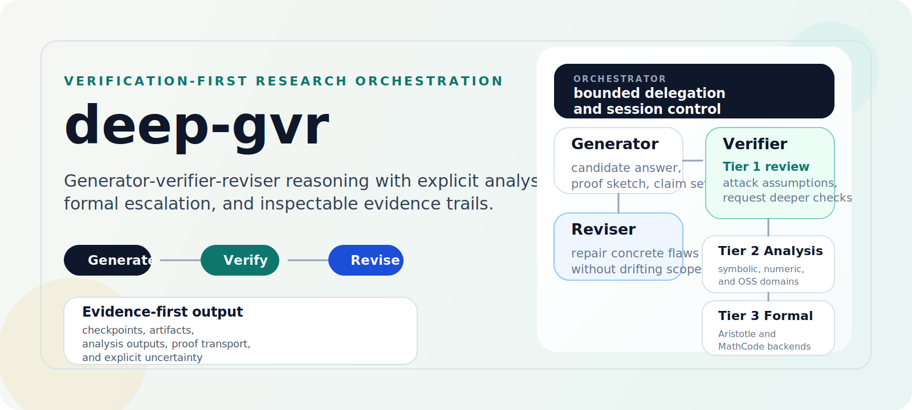

<p align="center">
  
</p>

# deep-gvr

[](https://github.com/sghowell/deep-gvr/actions/workflows/ci.yml)
[](LICENSE)
[](https://www.python.org/downloads/release/python-3120/)

`deep-gvr` is a verification-oriented research system for Hermes Agent, Codex local, and direct CLI use. It uses a generator-verifier-reviser loop to answer difficult technical questions with explicit analytical, computational, and formal verification.

It is built for people who want more than a polished answer. `deep-gvr` is designed to show its work: what it claimed, how it checked the claim, what evidence it produced, and where it could not verify enough to be confident.

## Why It Exists

Most agent systems optimize for fluency. `deep-gvr` optimizes for adversarial checking.

Its core idea is simple:

- generate a candidate answer
- try to break it with an isolated verifier
- escalate into analysis or formal proof when the claim requires it
- revise, branch, or stop with an explicit failure mode

That makes it useful for research-style questions where correctness matters more than style.

<p align="center">
  
</p>

## What You Get

- A structured generator-verifier-reviser workflow
- Three verification tiers:
  - Tier 1 analytical review
  - Tier 2 OSS-backed computational analysis
  - Tier 3 formal verification
- Explicit artifacts: checkpoints, evidence logs, analysis outputs, and proof transport records
- A domain-agnostic adapter architecture with strong support for math, optimization, dynamics, and open-source quantum tooling
- Supported local operator surfaces through Hermes, Codex local, and `uv run deep-gvr`

## A Typical Question

```text
/deep-gvr "Explain why the surface code is understood to have a threshold."
```

Codex local can drive the same runtime from a local checkout:

```bash
codex exec -C /path/to/deep-gvr "Use the deep-gvr skill to answer: Explain why the surface code is understood to have a threshold."
```

A successful run typically:

1. grounds itself in known literature and domain context
2. produces a candidate explanation
3. checks the explanation adversarially at Tier 1
4. requests Tier 2 or Tier 3 only if the claim actually needs them
5. writes evidence and artifacts under `~/.hermes/deep-gvr/sessions/<session_id>/`

## Quick Start

`deep-gvr` is built for Python 3.12 and [`uv`](https://github.com/astral-sh/uv).

```bash
uv sync
uv sync --extra analysis --extra quantum_oss
bash scripts/install.sh
uv run python scripts/release_preflight.py --operator --config ~/.hermes/deep-gvr/config.yaml
uv run deep-gvr run "Explain why the surface code is understood to have a threshold."
```

If you want the Codex-local surface as well:

```bash
bash scripts/install_codex.sh
uv run python scripts/codex_preflight.py --operator
```

Once installed into Hermes, the same system is available as:

```text
/deep-gvr <question>
/deep-gvr resume <session_id>
```

For the full operator path, see [Quickstart](docs/quickstart.md) and [Release Workflow](docs/release-workflow.md).

## Docs Map

Start here:

- [Docs Home](docs/index.md)
- [Start Here](docs/start-here.md)
- [Codex Local](docs/codex-local.md)
- [Quickstart](docs/quickstart.md)
- [Concepts](docs/concepts.md)
- [Domain Portfolio](docs/domain-portfolio.md)
- [Examples](docs/examples.md)
- [FAQ](docs/faq.md)

Technical reference:

- [System Overview](docs/system-overview.md)
- [Architecture and Design](docs/deep-gvr-architecture.md)
- [Release Workflow](docs/release-workflow.md)

Release history:

- [Changelog](CHANGELOG.md)
- [GitHub Releases](https://github.com/sghowell/deep-gvr/releases)

## Current Scope and Limits

- `deep-gvr` is a verification-oriented research system, not a general-purpose chatbot.
- Tier 2 and Tier 3 are selective. They are used when the claim warrants them, not on every run.
- Local operation is the default path. Some optional backends depend on external tools or remote infrastructure.
- The shipped Tier 3 backends are Aristotle and MathCode. OpenGauss remains an intended backend, but it is not part of the standard release path today.
- Codex local is a supported peer surface, but the shipped delegated execution backend still routes through Hermes today.
- Some advanced Hermes-native capabilities, especially true per-subagent routing and delegated MCP inheritance, still depend on upstream Hermes support.

## What It Is Not

- Not a fine-tuned model
- Not a single proprietary stack
- Not limited to quantum computing
- Not a system that always claims success

When `deep-gvr` cannot verify something to the required standard, it is expected to say so.
