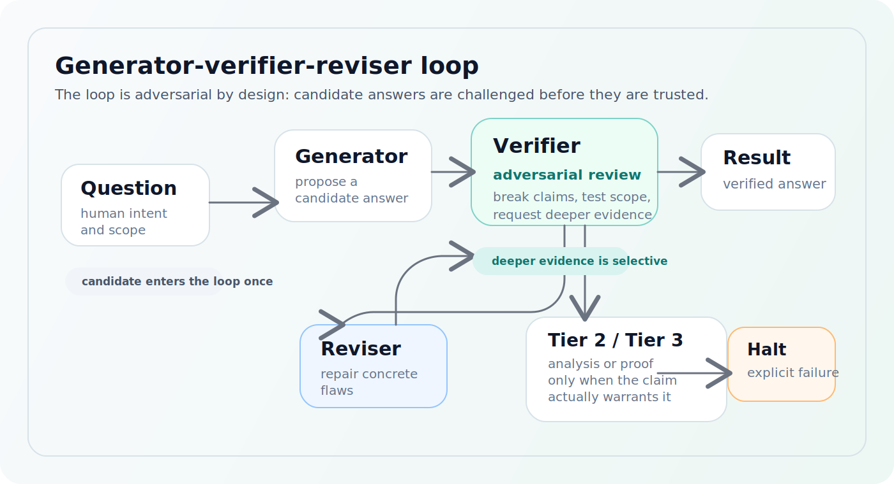

# Concepts

`deep-gvr` is built around one idea: answers should be challenged before they are trusted.

## The GVR Loop

The system runs a generator-verifier-reviser loop:

<figure class="doc-figure">
  
  <figcaption>The verifier is the control point: it can accept, reject, revise, or escalate for deeper evidence.</figcaption>
</figure>

Each role has a different job:

- Generator: produce a candidate answer
- Verifier: attack the candidate on its own merits
- Reviser: fix concrete flaws instead of starting over blindly
- Orchestrator: manage state, evidence, escalation, and user communication

## Verification Tiers

### Tier 1: Analytical

This always runs.

Tier 1 checks whether the candidate is coherent, complete, supported by citations, and honest about what follows from the evidence.

### Tier 2: Computational Analysis

Tier 2 is used when a claim needs executable checking.

This can include:

- symbolic verification
- optimization checks
- dynamics or numerical integration
- QEC benchmarking
- graph-state, photonic, neutral-atom, topological-QEC, or ZX-based analyses

Tier 2 exists because some claims are not meaningfully settled by prose alone.

### Tier 3: Formal Verification

Tier 3 is used when the claim is formalizable enough to justify proof-oriented machinery.

The shipped release surface supports Aristotle and MathCode. A Tier 3 result can prove, disprove, time out, or fail explicitly. In all of those cases, the system is expected to record what happened rather than blur it into a generic response.

## Evidence and Checkpoints

`deep-gvr` is built to preserve a research trail.

Each run maintains:

- a session checkpoint
- evidence records
- analysis or formal artifacts when deeper tiers are used
- derived summaries for reuse and export

That makes the system resumable and inspectable. The answer is only part of the output; the evidence trail is part of the product.

## Escalation and Fan-out

Not every failure should produce the same retry.

When repeated failure suggests the system is stuck, `deep-gvr` can:

- revise the current branch
- switch to an alternative branch
- halt with an explicit failure state

This keeps the system from silently looping on one bad framing.

## Why the Verifier Matters

The verifier is not a formatting pass. It is the core reliability mechanism.

The point of `deep-gvr` is not merely to produce a clever answer. The point is to create a workflow where claims are challenged, evidence is accumulated, and uncertainty is surfaced instead of hidden.
